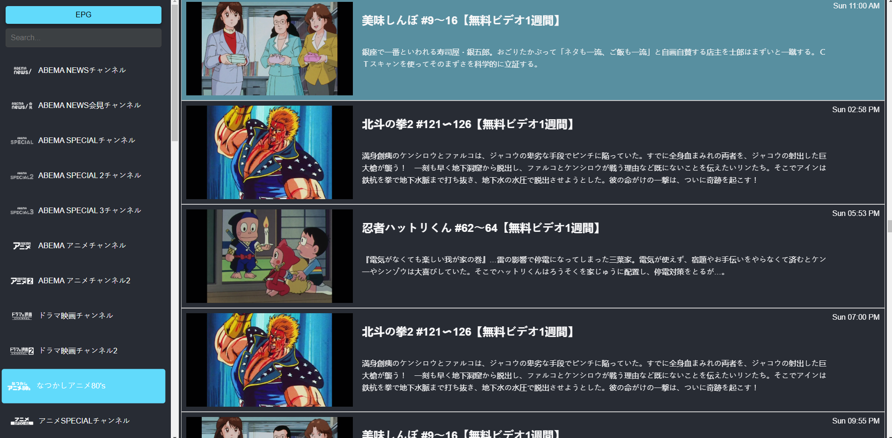
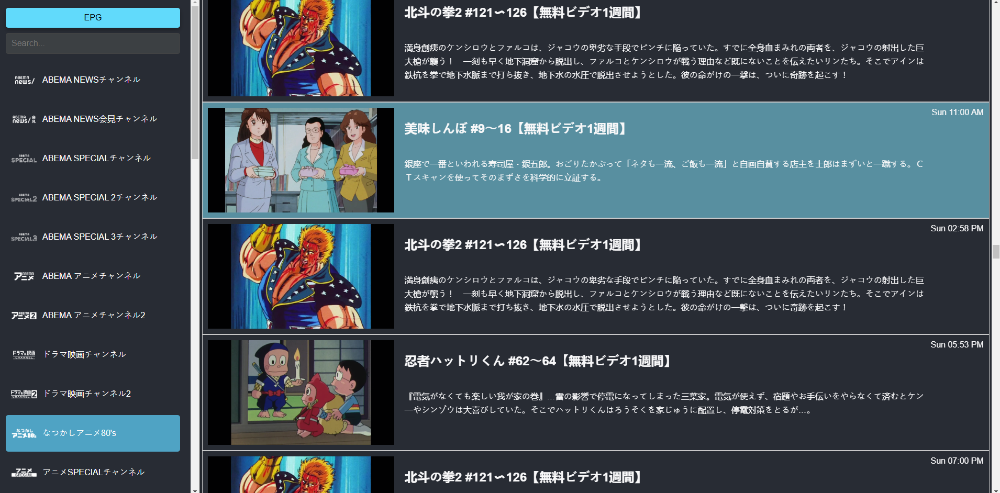
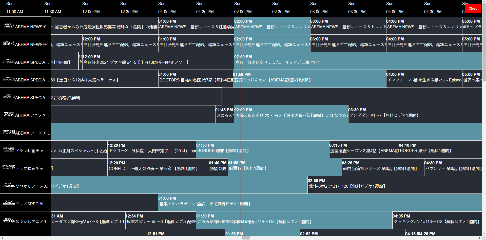
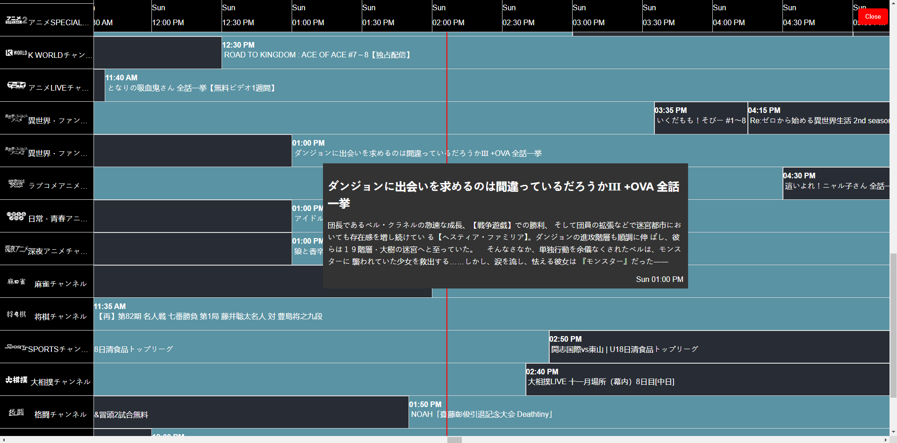
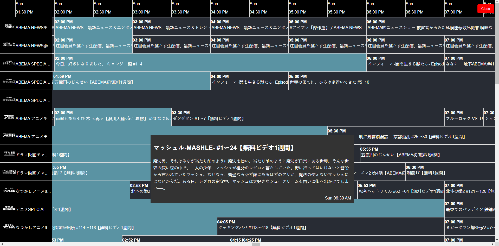

##Abema-TV
Watch Abema TV channels with EPG

https://dbghelp.github.io/player.html?file=https://raw.githubusercontent.com/dbghelp/Watch-Abema-TV/refs/heads/main/abema.m3u8

- Mouse over channel logo to view EPG for specific channel (with thumbnail images from epg.xml)
- Click on EPG button to view EPG for all channels (Traditional EPG)
- Accessible via Japan IP only

## Screenshots

## Check out html iptv player

HTML IPTV Player with EPG viewer for M3U8 playlist

https://dbghelp.github.io/player.html?file=<link to playlist.m3u8\>

https://dbghelp.github.io/player.html?file=https://dbghelp.github.io/playlist.m3u8
